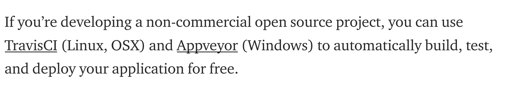

### Android & iOS app creation
* ~~[Jasonelle](https://github.com/jasonelle): simple mobile app framework using JSON~~

### Book covers API
* [OpenLibrary API](https://openlibrary.org/developers/api)
* [LibraryThing](https://www.librarything.com/services/)

### Various
* Python
    - [Luigi](https://luigi.readthedocs.io/en/stable/): build complex pipelines of batch jobs. It handles dependency resolution, workflow management, visualization, handling failures, command line integration, and much more.
* Machine learning
    - [Netron](https://github.com/lutzroeder/Netron): a viewer for neural network, deep learning and machine learning models.
* Data mining
    - [Github de Datos Argentina](https://medium.com/datos-argentina/c%C3%B3mo-organizamos-el-github-de-datos-argentina-67026d2a6dd1)
* Release tracking
    
* CSS (toolbox & to play sandboxed)
    - [Universal CSS](https://github.com/marmelab/universal.css): to play around with specifications
* Communication and File sharing
    - ~~[HyperHyper Space](https://hyperhyper.space/)~~
* Progressive Web Apps
    - [PWA Starter Kit](https://pwa-starter-kit.polymer-project.org/)
* Programming environment 
    - https://repl.it
* Github link checker (updates)
    - [awesome bot](https://github.com/dkhamsing/awesome_bot)
* PDF Viewer (wrapper in an `browser-windows`)
    - [PDF-Window](https://github.com/gerhardberger/electron-pdf-window)
    - [React PDF viewer](https://react-pdf-viewer.dev/)
* PDF command-line
    - [Percollate](https://github.com/danburzo/percollate/)
* SPA deployment
    - ~~[Zeit Now](https://zeit.co/docs): cloud platform for static sites and Serverless Functions. It enables developers to host websites and web services that deploy instantly, scale automatically, and requires no supervision, all with no configuration.~~
    - [Vercel](https://vercel.com/): Vercel is the optimal workflow for frontend teams. All-in-one: Static and JAMstack deployment, Serverless Functions, and Global CDN
* Code sharing (and invitation to participate too)
    - ~~[Heroku & Slack](https://macadmins.herokuapp.com/) => [Slacking](https://github.com/rauchg/slackin)~~
* Speech recognition
    - [Espeak](https://github.com/espeak-ng/espeak-ng)
* NPM generator (to generate/automatize documentation)
    - https://github.com/kefranabg/readme-md-generator
* Testing Apps with TestFlight (iOS)
    - [Beta testing offers through the AppStore](https://testflight.apple.com/join/ngU3gLEv). By the way, _imho_ needs a non-free developer license (to offer this beta testing)
* Collecting data (offline & online mode)
    - [Kokotoolbox](https://www.kobotoolbox.org/)
* Diagram & chart (data visualization)
		- [Mermaid](https://mermaid.js.org/)

### React
* Create your own React
    - [Didact](https://github.com/pomber/didact)
* React (alternative with a minimalistic approach)
    - [alt-react](https://github.com/bryanbraun/alt-react-demo)

### Webapps
* Testing to webapps
    - [gremlins](https://github.com/marmelab/gremlins.js)
* Webapps in javascript flavour
    - [Hyperapp](https://github.com/jorgebucaran/hyperapp)
* Cross-platform apps
    - [Deskfiler](https://www.deskfiler.org/)

### R 
* R meets maps
    - [tmap: thematic maps in R](https://github.com/mtennekes/tmap)
* Mobile data collection
    - [Open Data Kit](https://opendatakit.org/): Some examples can be found [here](https://opendatakit.org/community/research/)
* Twitter meets R
    - https://github.com/yihui/twitter-blogdown
* R applied to digital humanities
    - [RLetters](https://github.com/rletters/rletters)
* R plus data visualization
    - [WeareVisualizers](https://github.com/WeAreVisualizers)
* Semantics in R
    - [Semantic flow graphs](https://github.com/IBM/semanticflowgraph/)
* R meets Qgis
    - [RQGIS3](https://github.com/jannes-m/RQGIS3) establishes an interface between R and QGIS3. [Paper](https://rjournal.github.io/archive/2017/RJ-2017-067/RJ-2017-067.pdf)
* R + visual exploration
    - [DrWhy.AI - the collection of tools for Visual Exploration, Explanation and Debugging of Predictive Models](https://github.com/ModelOriented/DrWhy)
* R programming
    - [Efficient R programming](https://csgillespie.github.io/efficientR/)
    - [R code style guide](https://github.com/romunov/r_style_guide)
* R plus Github data analysis (and data visualization)
    - [How to obtain a bunch of GitHub issues or pull requests with R](https://github.com/jennybc/analyze-github-stuff-with-r)
    - [ESRI R meetup](https://r-arcgis.github.io/)
    
### GIS
* Cartography
    - https://twitter.com/OSUCartoGroup
    - [MapBox Studio Dataset Editor](https://studio.mapbox.com/)
* Create a geospatial IDE
    - https://www.idera.gob.ar/index.php?option=com_content&view=article&id=186&Itemid=454
* OpenStreetMap geotagging
    - [Transport planning](https://github.com/Robinlovelace/osm4transport)
* QGIS on Android
    - *check this* [query](https://play.google.com/store/search?q=qfield&c=apps)
    - check [ESRI Github repos](https://esri.github.io/)
* FWTools: Open Source GIS Binary Kit for Windows
    - [FWTools](http://fwtools.maptools.org/)
* Urban planning
    - [Urban Sim](https://github.com/UDST/urbansim)
* Data visualization
    - [Keppler](https://kepler.gl/)
* Blender + Gis
    - [BlenderGIS](https://github.com/domlysz/BlenderGIS)
      
    
* Pandas & Geopandas
    - [Explore UK Crime Data with Pandas and Geopandas](https://github.com/IBMDeveloperUK/geopandas-workshop): geopandas data-spatial analysis

### Automatization
* [Puppeteer](https://github.com/puppeteer/puppeteer)
    
### 3d reconstruction
* [Curated list of 3d reconstruction projects](https://github.com/openMVG/awesome_3DReconstruction_list)
* [Putting a Mountain Of Data In Your Hands - From a Point Cloud to a 3D Printed Model using ENVI LiDAR and IDL](https://www.harrisgeospatial.com/Learn/Blogs/Blog-Details/ArtMID/10198/ArticleID/19905/Putting-a-Mountain-Of-Data-In-Your-Hands-From-a-Point-Cloud-to-a-3D-Printed-Model-using-ENVI-LiDAR-and-IDL)
* Photogrammetry
    - [OpenSfM](https://www.opensfm.org/): reconstructing camera poses and 3D scenes from multiple images

### Digital publishing
* [Magic Book Project](https://github.com/runemadsen/Magic-Book-Project)
* [Sigil Ebook](https://sigil-ebook.com): multi-platform EPUB ebook Editor
* [weasyprint](https://github.com/Kozea/WeasyPrint) ([website](https://weasyprint.org/))
* [bindery.js](https://github.com/evnbr/bindery) ([website](https://evanbrooks.info/bindery/))
* [HummusJS](https://github.com/galkahana/HummusJS)
* [Editoria](https://gitlab.coko.foundation/editoria/editoria) → ([website](https://editoria.pub/))
* [pagedjs](https://gitlab.pagedmedia.org/tools/pagedjs) ([article](https://www.pagedmedia.org/pagedjs-sneak-peeks/))
* [Mercury](https://mercury.postlight.com/)
* [Foliojs](https://github.com/foliojs)
* [BookDown](https://bookdown.org/): Write HTML, PDF, ePub, and Kindle books with R Markdown
* https://bindery.info/
* https://pagedjs.org/

### Accesibility
* [Davidson accesibility](https://digitallearning.davidson.edu/accessibility/)

### Privacy & law
* [iubenda](https://www.iubenda.com/en/)

### Archiving & web scrapping
* [archive.ph](https://archive.ph/)
